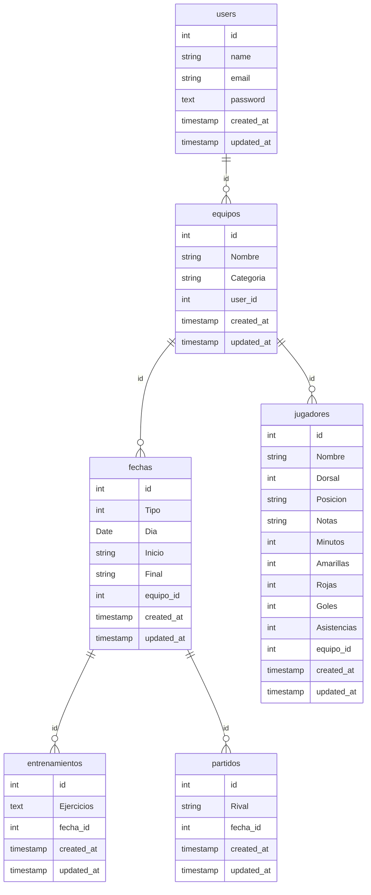

***

# CoachHub

CoachHub es una aplicación web la cual trata de hacerle la vida más facil a los entrenadores que desean llevar el análisis de datos al siguiente nivel y optimizar el rendimiento de sus equipos. Quiero que la aplicación permita a un entrenador facilitarle varias acciones como ver los partidos que vienen, guardarse las instrucciones tácticas, programar entrenamientos y observar estadísticas.

## Características principales:

- Recopilación de datos eficaz y sencilla.
- Creación de ejercicios (pizarra digital).
- Calendario con partidos y entrenamientos.

## Tecnologías usadas (en principio)

   
 

## Base de datos (en principio)

## Estado del proyecto 📝

Por comenzar ⌛

## Contacto 💬 

Si surge algún problema con la aplicación, me lo puedes comunicar en docejavii@gmail.com.

## Autor

<a href="https://github.com/javiidoce"> Javier Melendo </a>

## Licencia ⚡

Copyright 2025 Javier Melendo Soler 

Por la presente se concede permiso, libre de cargos, a cualquier persona que obtenga una copia de este software y de los archivos de documentación asociados a utilizar CoachHub sin restricción, incluyendo sin limitación los derechos a usar, copiar, modificar, fusionar, publicar, distribuir, sublicenciar, y/o vender copias de CoachHub, y a permitir a las personas a las que se les proporcione el programa a hacer lo mismo, sujeto a las siguientes condiciones:  El aviso de copyright anterior y este aviso de permiso se incluirán en todas las copias o partes sustanciales del Software.  

EL SOFTWARE SE PROPORCIONA "COMO ESTÁ", SIN GARANTÍA DE NINGÚN TIPO, EXPRESA O IMPLÍCITA, INCLUYENDO PERO NO LIMITADO A GARANTÍAS DE COMERCIALIZACIÓN, IDONEIDAD PARA UN PROPÓSITO PARTICULAR E INCUMPLIMIENTO. EN NINGÚN CASO LOS AUTORES O PROPIETARIOS DE LOS DERECHOS DE AUTOR SERÁN RESPONSABLES DE NINGUNA RECLAMACIÓN, DAÑOS U OTRAS RESPONSABILIDADES, YA SEA EN UNA ACCIÓN DE CONTRATO, AGRAVIO O CUALQUIER OTRO MOTIVO, DERIVADAS DE, FUERA DE O EN CONEXIÓN CON EL SOFTWARE O SU USO U OTRO TIPO DE ACCIONES EN EL SOFTWARE.

